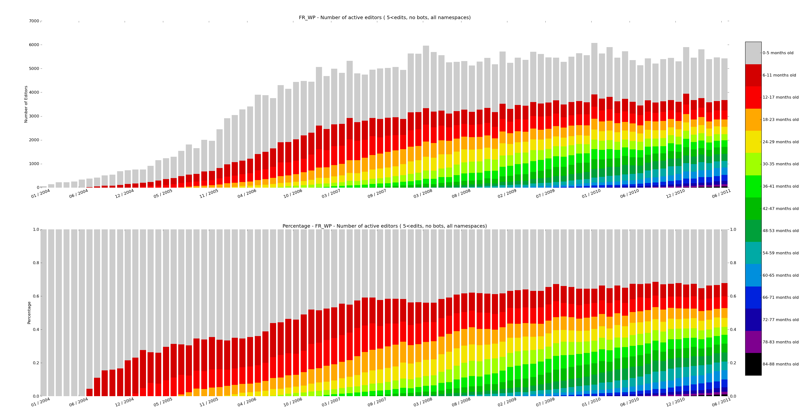
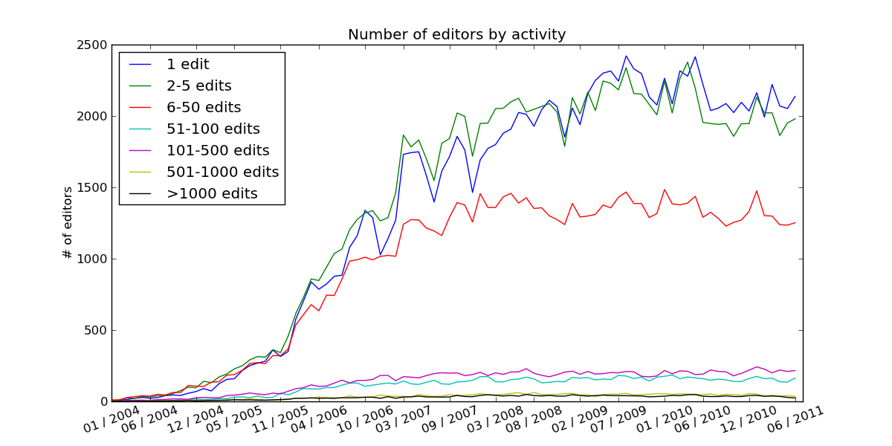

.. WikiPride documentation master file, created by
   sphinx-quickstart on Mon Aug 29 15:30:10 2011.
   You can adapt this file completely to your liking, but it should at least
   contain the root `toctree` directive.

WikiPride's documentation!
=====================================

WikiPride is a framework for analyzing and visualizing Wikipedia data. Starting off with the Wikimedia SQL databases (for example on the `Toolserver <http://toolserver.org/>`_), the data is aggregated into an editor trends 'friendly' format. It can then be visualized in `stacked bar charts <http://meta.wikimedia.org/wiki/Research:WikiPride>`_ whose pretty colors have given this framework its name, or analyzed using a time series framework like `panda <http://pandas.sourceforge.net/>`_. This package is built on tools and findings from the `Summer of Research 2011 <http://meta.wikimedia.org/wiki/Research:Wikimedia_Summer_of_Research_2011>`_ by the Wikimedia foundation. 

Note that this project (hopefully) becomes obselete when the new `analytics cluster <http://www.mediawiki.org/wiki/Analytics/Kraken>`_ is up and running.  

.. _requirements:

Requirements
=====================================

The following packages are used

* argparse
* numpy 
* MySQLdb
* matplotlib 

At the moment only unix environments are supported. 

.. _usage:

Usage
=====================================

First, create a configuration file that can be read by WikiPride. The following is an example configuration file (`de.config`) that configures WikiPride for the German wikipedia on the toolserver for the time period from January 2004 until Jan 2012. You also need a user database for storing auxiliary tables, `u_declerambaul` in this case. The directories section specifies the folders where the resulting reports will be stored.

::

	[General]
	language = de
	filterbots = True
	startYM = 200401
	endYM = 201201

	[Directories]
	cmapname = 'spectral'
	basedirectory = ~/example
	datadirectory = %(basedirectory)s/data
	userlistdirectory = %(basedirectory)s/userlists
	reportdirectory = %(basedirectory)s/report	
	wikipridedirectory = %(basedirectory)s/wikipride

	[MySQL]
	sqlhost = dewiki-p.rrdb.toolserver.org
	sqlwikidb = dewiki_p
	sqluserdb = u_declerambaul
	sqlconfigfile = ~/.my.cnf
	sqldroptables = False

Next, one can simply invoke one of the three workflow steps.

* preprocessing : aggregate mediawiki SQL tables into analytic-friendly auxialiary tables
* data : compute the cohort analysis data (prerequisite: preprocessing workstep)
* report : create a set of standard reports (prerequisite: data workstep)
* all : preprocessing, data and report

::

	python wikipride -c de.config preprocessing
	python wikipride -c de.config data
	python wikipride -c de.config report

Alternatively, you can use the `example/runLanguages.sh` script to generate complete reports for all language codes passed as parameters.

.. _cohort_definition:

Editor cohorts
=====================================

The concept of a cohort is introduced to extract aggregate statistics about editor behaviour. 

* First a set of editors is selected, the goal being to analyze their contributing trends. Usually this set is comprised of all editors on Wikipedia, though often the users flagged as bots are filtered. Alternatively, the set could contain only users of a certain tool like Huggle. 

* A cohort definition specifies a distribution over the editors. For each time unit, e.g. month, every editor in the set is uniquely associated with one cohort. For example:

	* For absolute age per month cohorts, :class:`cohorts.age.AbsoluteAgePerMonth`, an editor is assigned to the cohort that corresponds to the number of month since the first edit of the editor. 
	* For edit activity histogram cohorts, :class:`cohorts.histogram.EditorActivity`, a cohort is associated with a range of edits an editor has made in given month (e.g. 100-500 edits). Each editor is assigned to the edits bin he falls into for that month. 

* Metrics can be collected for each encountered data point. For example:

	* The number of edits made by the cohort in a given month
	* The number of bytes added/removed by each cohort in a given month
	* The number of editors in a cohort	

The abstract class :class:`cohorts.base.Cohort` defines variables and methods that need to be implemented by every subclass:

* :attr:`~.base.Cohort.sqlQuery`, the SQL query to the preprocessed tables. The aggregate statistics will be computed from the rows of the resultset
* :meth:`~.base.Cohort.initData`, initializes the data structure for the metrics to be collected.
* :meth:`~.base.Cohort.getIndex`, the method that determines which cohort the current row will be associated with.
* :meth:`~.base.Cohort.processSQLrow`, the method that extracts the data and updates the cohort metrics data structure.

The method :meth:`~.base.Cohort.aggregateDataFromSQL` is called by the instantiated sublass. It executes the :meth:`~.base.Cohort.processSQLrow` method for every row in the resultset returned by the :attr:`~.base.Cohort.sqlQuery` query.

.. _data_workflow:

Data Workflow
=====================================

Preprocessing
--------------
First, the data in the MediaWiki SQL database needs to be preprocessed, which is done in :meth:`data.preprocessing.process`. That method generates auxiliary SQL tables that are stored in the `sqluserdb` db, and all subsequent cohort analysis is done on these tables. The queries that create the tables are stored in the :mod:`data.tables` module.

Data aggregation
-----------------

Each cohort class implements the :meth:`.aggregateDataFromSQL` method, which computes the cohort statistics using the tables created in the preprocessing step. The :mod:`.report` module specifies a set of cohorts that serve as a report which can be generated automatically. The method :meth:`.report.processData` is computing the aggregates for all cohort defined in the report. 

Visualization
-----------------

The final step is the visualization of the aggregated data. See :ref:`wikipride_visualizations`.

.. _wikipride_visualizations:

WikiPride visualizations
=====================================

Stacked bar chart
---------------------

WikiPride visualizations represent the trends of editor cohorts using stacked bar charts with a color map. Each bar is on the x-axis represents a set of cohorts who's values are stacked. A wikipride plot can be produced for every collected metric (e.g. number of edits, bytes added). The :meth:`~.base.Cohort.wikiPride` method produces the plot.

Other graphs
---------------------

Other graphs can be created by implementing :meth:`~.base.Cohort.linePlots` in a subclass, for example see :meth:`.RelativeAgeAllNamespaces.linePlots`. Use the helper  methods :meth:`~.base.Cohort.addLine` and :meth:`~.base.Cohort.saveFigure`. The built-in report generates visualizations with the :meth:`.ReportItem.generateVisualizations` call.

